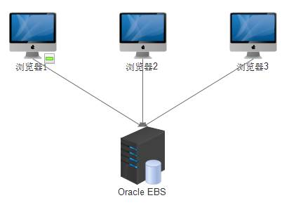

<h1>1.3 Java Applet + Oracle数据库</h1>
第3个框架是在某国家级电网做的一个项目，项目比较大，总投资5个亿，持续了好多年。

　　首先很多小伙伴可能对Java Applet不是很熟悉，我先介绍一下，它是一种嵌入到网页中的小程序，Java语言开发，可以通过互联网发布到任何具有Java编译环境浏览器的个体机上。H5里面，这玩样已经被淘汰了。  
　　项目属于一套资产管理系统，用户分布于整个华北地区市属电力局，所有500KV，220KV，110KV的变配电站全部囊括其中，数据差不多有几十亿吧。  
　　这个项目真可谓是单机数据库的极限了，采用了OracleEBS套件(类似于SAP的ERP套件)，光采购设备就花了上千万，还是单机的，这不是我们现在mysql这种数据库可以想象的。  
　　所有的服务器和客户端都处于同一个VPN中，客户端采用IE浏览器打开Java applet应用，而服务端是在一台以Oracle数据库为基础的大型服务器上面。  
　　**好处**：Oracle套件，大公司支持。  
　　**坏处**：慢，界面很不友好，单机，费钱。  