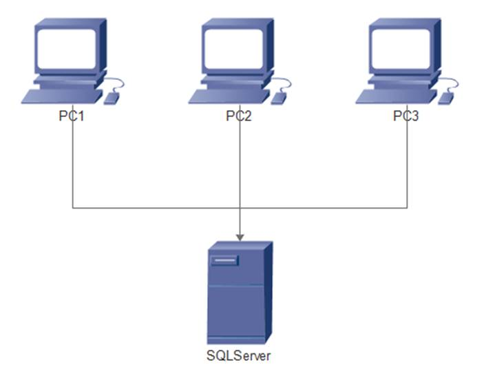

<h1>1.1 Windows Application + DB</h1>

第1个框架，也是我经历的第一个项目，一个非常复杂的供销存系统，当时我还在读大学，在一家公司实习。

供销存系统架构图

  	项目是我们为一家位于浙北的台商工厂做的，属于局域网应用，用户大概2,30人，分为财务，销售，仓库，生产等多个windows程序，用Delphi开发的。程序拖拉控件，订阅事件，直接操作数据库，架构也非常简单。

  	好处：架构简单，开发方便。

  	坏处：部署麻烦，每次都要去客户现场。没有规范，代码不好维护。不能支持太多用户，程序的性能取决于数据量。

