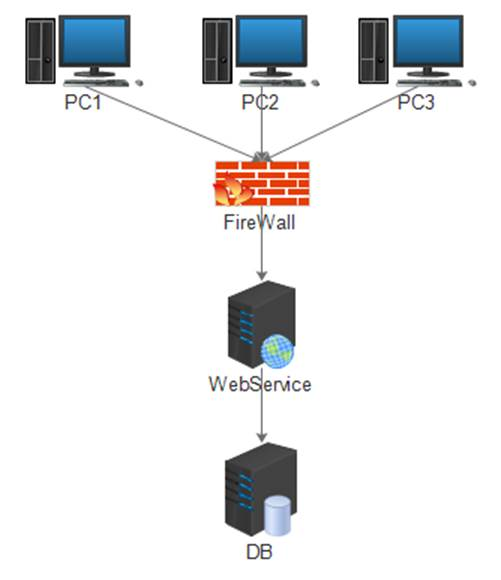

<h1>1.2 Windows Application + WebService + DB</h1>

　　第2个框架是我第一份工作项目所用，主要场景是给整个市下辖所有的变配电站提供信息系统软件。  

XXX电力局输变配系统

　　用户主要分布于各县区的变配电站中，拨号上网，访问中心服务器机房。用户在PC上安装系统客户端，客户端为C#开发的Windows Application，服务端Java开发，使用WebService提供接口，WebService访问数据库。  
**采用WebService好处主要有：**  

- 数据库不直接对外暴露，数据库相对是安全的 

- WebService采用Http协议通讯，可以无缝的透过防火墙 

- 业务逻辑的变更在服务端完成，减少维护成本（这种架构的客户端新装或者大的升级都还是需要到现场部署的） 

**坏处有：**

- WebService采用xml传输报文，报文体过大，影响传输性能

- Web Service接口安全性不好控制，比如访问权限等

