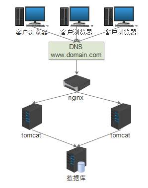

<h1>1.4Nginx + Servlet + Mysql</h1>
　　第4个项目也算是一个初级的分布式项目了。  

　　本项目是一个基于互联网的管理系统，客户是一个上市公司。  
　　用户是该公司位于全国各地的经销商及后台的管理员工，经销商每天需要上报自己的经营情况，后台员工统计分析，用户数大概1000多。  
　　首先服务端是采用Javassh开发的servlet程序，前置采用nginx反向代理，把请求均匀分发到tomcat中。由于涉及到负载均衡等问题，项目采用无session设计（即cookie中存token等用户信息，到服务端就直接从数据库拿），文件存储采用linux目录共享技术实现。  
　　**好处**：采用反向代理，可以动态扩容。  
　　**坏处**：数据库是瓶颈，项目随着时间迁移变的越来越臃肿，文件系统有单点风险。  