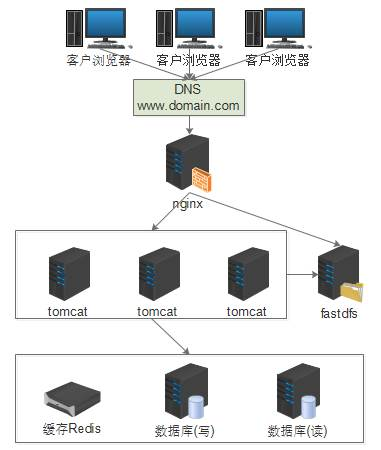

<h1>1.5Nginx+Servlet+Redis+Fastdfs + 读写分离</h1>

　　第5个项目算是第四个项目的升级版，引入缓存，读写分离，降低数据库压力，引入文件系统。  
　　

　　本项目是给一个券商开发的交易系统。项目架构针对第4个架构存在的一些问题进行解决，主要是针对数据库压力做了优化。  
　　首先引入缓存，解决分布式Session等问题，同时将部分数据缓存到Redis中，提高查询性能的同时还可以降低数据库压力。  
　　读写分离采用mysqlbinlog复制将数据从主库同步到备库，所有大查询及报表系统连接到备库进行读操作，其好处是可以减少主库的连接数，同时将耗时较长的查询放在备库，提高主库性能。  
　　FastDFS是一个开源的轻量级分布式文件系统，我们采用了双主互备的模式部署，前置nginx反向代理进行读访问，业务系统负责写操作。  
　　**好处**：降低数据库压力，文件系统不再是单点应用  
　　**坏处**：nginx有单点风险，项目及数据库臃肿，文件系统流量过大影响带宽。  