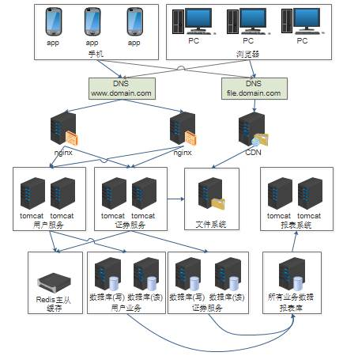

<h1>1.6Nginx + CDN + 数据库分离</h1>

　　第6个架构其实是对第5个项目的升级改造。  

　　该版本增加了对app的支持，采用nginx + keepalived多机主备，同时又引入了CDN。  
　　其中CDN相当于是文件的缓存，它有专门的服务供应商，你可以将一些静态资源（如图片，html文件，js脚本等）存放在CDN服务器上，通过DNS解析将访问应用服务器的请求转向到CDN服务器上，从而减少应用服务器的流量，降低带宽需求。  
　　该版本最大的改动是将系统按业务进行划分，每个业务单独服务，单独数据库，主备分离，量大的数据又按用户ID取模分表存储，同时将各业务库的数据同步到报表库以方便统计查询。  
　　**好处**：业务分库分表，再次降低数据库的压力，解决nginx性能瓶颈问题，CDN减少服务器流量，解决带宽问题。  
　　**坏处**：服务增多，URL管理显得有些混乱。接口版本的管理难度增大，想要做灰度几乎不可能。业务划分带来了分布式事务，幂等，通讯掉单等问题。随着时间推移，报表库会越来越大，直至最后无法承载。没有服务发现等支持，导致服务之间调用成了难题，互相之间不知道有哪些服务器组成，每个服务都需要写自己的负载均衡。团队规模扩大，沟通成本增加。  