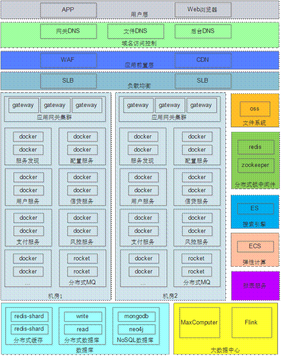
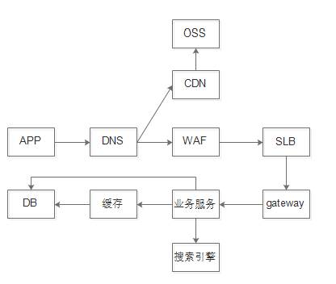

<h1>1.7WAF + SLB + 分布式数据库 + 大数据 + 弹性计算</h1>

　　第7个架构是我在一家互金企业自己运营的贷款平台。整个平台搭建在阿里云上，运用了阿里云全套技术作为我们系统的支撑，架构如下：  

　　首先系统从负载均衡层往下全部在局域网内，用户通过域名访问系统，只能看到WAF和CDN的地址。数据请求的服务器流转过程如下：  

　　1、APP通过域名访问服务器，如https://gateway.domain.com/xxxxx。  

　　2、配置域名解析可以知道访问的是静态资源还是动态资源。比如https://file.domain.com指向静态资源，https://gateway.domain.com指向动态资源。  

　　3、如果是静态资源，请求会转向CDN，阿里云OSS提供自动将文件系统中的文件映射到CDN中。  

　　4、如果是动态资源，需要先经过WAF安全扫描，WAF是阿里云提供的Web应用防火墙，提供诸如QPS统计，XSS拦截，DDos攻击防御等常用互联网防火功能。  

　　5、通过WAF后，由SLB将请求从外网转发至内网中，SLB是一个类似于nginx的负载均衡服务器，我们通过SLB可以控制数据的流向来实现灰度发布。  

　　6、SLB之后是应用网关，它的作用是提供统一对外入口，协议转换，权限控制等  

　　7、网关之后便是应用服务器，它会与数据库，缓存，搜索引擎等进行交互，返回数据。  

　　8、应用服务采用Docker容器化管理。  

　　9、报表系统采用MaxComputer大数据工具进行开发，用于非实时数据统计，采用Flink流式计算用于实时数据统计。统计结果会同步到关系型数据库中，方便查询。  

　　10、为了解决分布式场景下资源竞争的问题，引入Redis和Zookeeper实现分布式锁。  

　　11、MQ每个机房部署一套为了避免机房1产生的数据被机房2消费掉。  

　　12、弹性计算是是阿里云提供一种在某些场景下动态自动扩充服务器的技术，我们利用它在每天上午10点，大量用户挤入借款的时候，自动的增加几台服务器抗压，等到12点峰值降下来后又自动释放服务器，实现资源合理利用。  

　　**好处**：系统稳定，高可用，一般场景下，没有组件会成为瓶颈。  

　　**坏处**：服务治理麻烦，需要联系各方面同步，团队越大，治理越麻烦。多产品运营会浪费大量资源。没有合适的异步通知手段。  