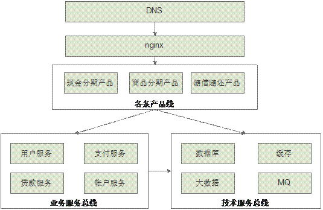

<h1>2.8规划中的架构</h1>
　　3.2.7所述的架构对于单个产品来说已经比较完善了，可以解决绝大部分互联网应用存在的问题，但是当企业规模扩大，产品越来越多的时候，我们发现，如果每一个产品都照搬这套架构的话，会有很多功能都是重复开发，造成大量资源的浪费，举个例子，我们现金分期产品有支付功能，而商品分期产品也有支付功能，由于产品由2个不同团队开发，导致支付功能重复开发了，这对于企业来说是一种极大的浪费。同样不同团队采用技术不一样，也是一种浪费，比如一个团队用mysql，一个团队用oracle，浪费包括学习成本，维护成本等。  

　　第8种架构在我这里目前来说还只是构想，我们还没有精力来做这方面的改造，它并不是真正意义上的技术架构，我更倾向于将它归类为组织架构。  

　　首先，将通用业务抽象提炼出来作为基础业务服务，将基础服务组合成业务服务总线，并且在整个集团中共享，所有产品线需要用到基础服务时，直接调用业务服务总线即可，而不需要花费很大代价去自己研发。  

　　而技术服务可以理解成统一集团内使用的各种技术，由专业的团队负责专门的维护和管理工作，技术选型团队对于各种不同的应用场景给出最佳实践建议，甚至可以形成一套可供参考的技术选型标准。像阿里云其实就是一个很好的技术市场，我们只要基于自己的场景给出一套标准即可。  