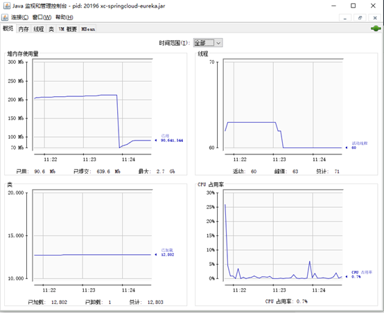
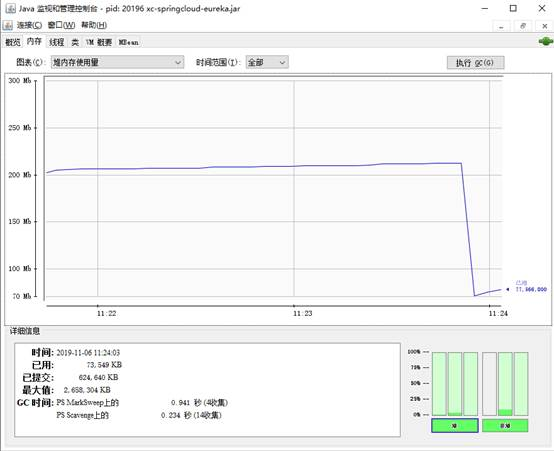
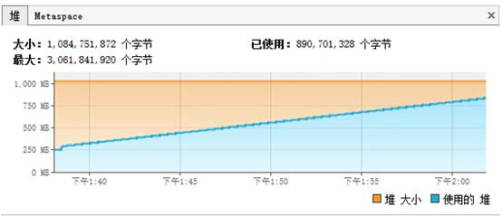
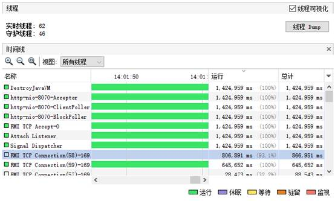
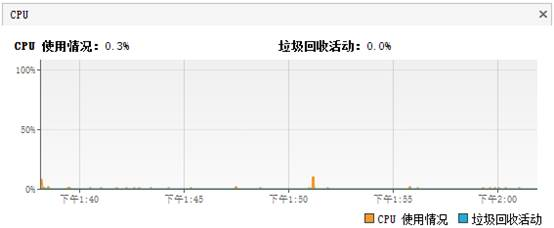

<h1>3.1.5内存调优</h1>

首先内存调优有有很多的工具，比如有Jstack， JConsole， JProfiler， VisualVM等。

  下面截几个图给大家看一下

  

  那么如何去调优呢？我举几个例子。

首先整个监控过程不是一蹴而就的，需要连续观察1天甚至几天，如果内存设置有问题，我们会发现使用曲线会在程序执行的过程当中会不断的升高，执行垃圾回收之后会下降，如此往复，整个使用曲线承上升趋势的话就有oom的风险，如下图

  

  为此就需要调整堆的大小来保证足够的内存开销。如果内存无休止的上涨，可以dump内存情况，查看哪些对象占用了更大的空间。

  观察gc的情况，如果次数比较频繁或者回收占用的时间比较长，就需要考虑更换gc的算法。

  大吞吐量的应用可以分配更大的Eden空间，减少Minargc的次数。

  有了堆信息基本可以解决新生代老年代的划分是否合理，内存泄漏，gc算法设置是否合理等问题。

  线程的使用情况可以查看哪一类的线程耗时较长，有没有死锁的情况。可以DUMP线程详情来查看线程内部运行情况。

  CPU的使用率如果居高不下，就表示有程序的逻辑是不合理的，可以先查看占用CPU高的PID，从PID中查出TID（线程id），再DUMP线程信息查看占用CPU的代码。往往这种while(true)的代码是引起CPU飙高的元凶。